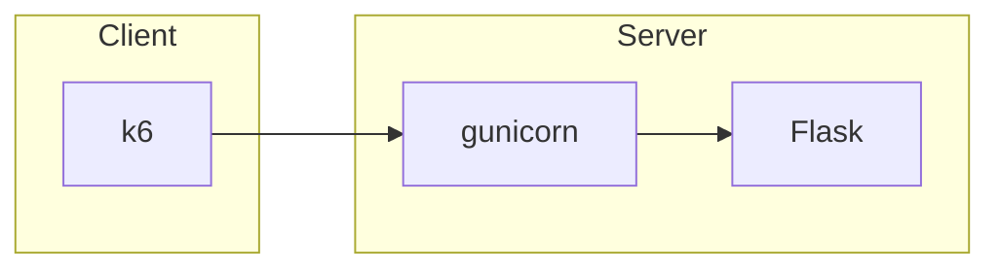

# Flask bench

This is a simple synthetic web benchmark using Flask. The server only has a URL
that receives two parameters, `it1` and `it2`, which control the number of
iterations of two loops to simulate busy CPU cycles. It uses `gunicorn` with the
recommended configuration of `(num_cpus*2)+1` workers.

The client uses [k6](https://k6.io/). It uses a default number of iterations and
duration. It injects in a closed loop, with no thinking time between requests.
It runs load injection experiments starting with 1 virtual user (VU) and
doubling the number of VUs until the requests per second (RPS) do not increase
significantly or there are failed requests.

The number of iterations (`it1`) and the duration is configurable.

This diagram shows the general architecture:



## Server

To build the server, run:

```bash
cd server
docker build -t flask/flask_bench_server . --build-arg SECRET_KEY="change_me"
docker run -d -p 80:80 flask/flask_bench_server
```

Remember to change the secret key with some random string.

You can test that the server works with this command:

```bash
curl "localhost/?it1=52250&it2=123"
```

## Client

To build the client, run:

```bash
cd client
docker build -t flask/flask_bench_client .
docker run -e SERVER=SERVER_IP flask/flask_bench_client
```

Remember to change the value `SERVER_IP` with the IP address of the server. For
instance:

```bash
docker run --rm -e SERVER=172.31.0.23 flask/flask_bench_client
```

This runs the client with the default number of iterations and duration of each
injection. If you want to change them, you can use environment variables in the
command line as in this example:

```bash
 docker run --rm -e SERVER=172.31.0.23 -e ITERATIONS=80000 -e DURATION=1s flask/flask_bench_client
```

Example of output:

```bash
Injecting with 1 vus
Injecting with 2 vus
Injecting with 4 vus
Injecting with 8 vus
Injecting with 16 vus

vus,rps,resp_time,req_failed
1,107.78563839363346,9.51176045,0
2,211.93202459701726,9.596483199999998,0
4,328.5085053816782,17.08476025,0
8,458.0607763421559,19.53548689999999,0
```

## PKB integration

In order to run this benchmark easily in a cloud environment, you can use
[PerfKitBenchmarker](https://googlecloudplatform.github.io/PerfKitBenchmarker/).
Run these commands (it is recommended that you create and activate a virtual
environment first):

```bash
git clone https://github.com/GoogleCloudPlatform/PerfKitBenchmarker.git
cd PerfKitBenchmarker
wget https://raw.githubusercontent.com/jentrialgo/flask_bench/main/pkb/flaskbench_benchmark.py -P perfkitbenchmarker/linux_benchmarks
pip3 install -r requirements.txt
```

Now you can run the benchmark with the default options like this:

```bash
./pkb.py --cloud=AWS --benchmarks=flask_benchmark --machine_type=c5.4xlarge --zone=eu-central-1
```

If you want to change the number of iterations or the duration, you can do it
with the flags `--flask_iterations` and `--flask_duration`, respectively, like
this:

```bash
./pkb.py --cloud=AWS --benchmarks=flask_benchmark --flask_iterations=60000 --flask_duration=30s --machine_type=c5.4xlarge --zone=eu-central-1
```
